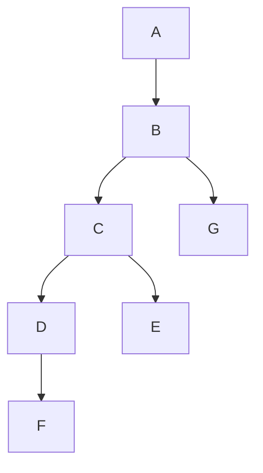

# Assignment 1128

## Problem 1

### (a)

### (b)

Dominate Frontier：

* $A: \empty$
* $B: \{B\}$
* $C: \{B,G\}$
* $D: \{ B\}$
* $E: \{ G\}$
* $F: \{ B\}$
* $G: \empty$

### (c)

#### p

$S \leftarrow defof(p)=\{F\}$

$DF^0(S)=\empty$

$DF^1(S)=DF(\{F\})=\{B\}$

$DF^2(S)=\{B\}$

在B节点需要插入p的phi指令

#### q

$S \leftarrow defof(p)=\{D\}$

$DF^0(S)=\empty$

$DF^1(S)=\{B\}$

$DF^2(S)=\{B\}$

在B节点需要插入p的phi指令

### (d)

执行完重命名后，控制流图变为：

