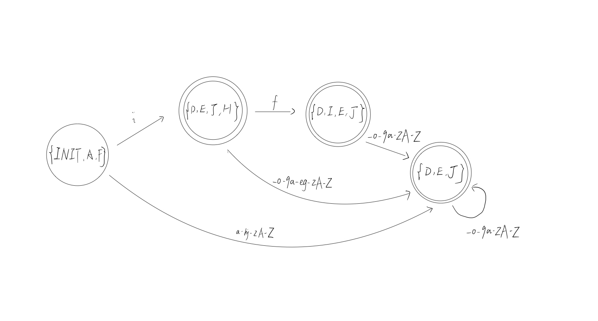

# Assignment0919a

## Problem 1

*集合对应关系：*

起始状态：{INIT, A, F}

i: {INIT, A, F} -> {D, E, J, H}

f: {D, E, J, H} -> {D, I, E, J}

\_0-9a-zA-Z: {D, I, E, J} -> {D,E,J}

\_0-9a-zA-Z:  {D,E,J} ->  {D,E,J}

\_0-9a-eg-zA-Z: {D, E, J, H} -> {D, E, J}

a-hj-zA-Z: {INIT, A, F} -> {D, E, J}

**DFA如下**：

## Problem 2

对应关系：

起始状态：{INIT,A,B,C}

a: {INIT, A,B,C} -> {A,B,C,D}

a: {A,B,C,D} -> {A, B,C,D} 

## Problem 3

对应关系：

起始状态：{INIT}

a: {INIT} -> {A,B,C,D,E,F,G,H}

b: {A,B,C,D,E,F,G,H} ->{L,P,C,Q,D,F,E,G,H}

​	b:{L,P,C,Q,D,F,E,G,H} -> {L,P,C,Q,D,F,E,G,H} 

​	a: {L,P,C,Q,D,F,E,G,H} -> {R} 			

​	c: {L,P,C,Q,D,F,E,G,H}  -> {M,N,I,J} 	

​		a:{M,N,I,J}  -> {O, P, C, Q, D, F, E, G, H}

​			a: {O, P, C, Q, D, F, E, G, H} -> {R}

​			b: {O, P, C, Q, D, F, E, G, H} -> {L, P, C, Q, D, E,F, G, H}		

​			c: {O, P, C, Q, D, F, E, G, H} -> {M,N,I,J}

​		c: {M,N,I,J} -> {K, C, Q, D, F, E, G,H}		

​			a: {K, C, Q, D, F, E, G,H}  -> {R}

​			b:{K, C, Q, D, F, E, G,H}  -> {L, P, C, Q, D, E,F, G, H}	

​			c: {K, C, Q, D, F, E, G,H}  ->  {M,N,I,J}		

c: {A,B,C,D,E,F,G,H} ->{M,N,I,J}

a: {A,B,C,D,E,F,G,H} ->{R}

